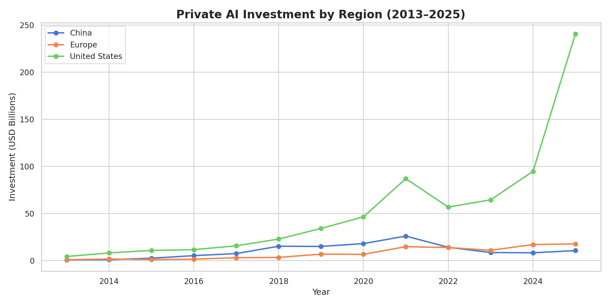
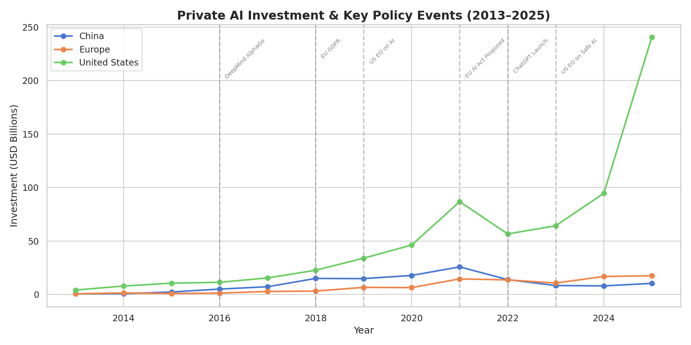
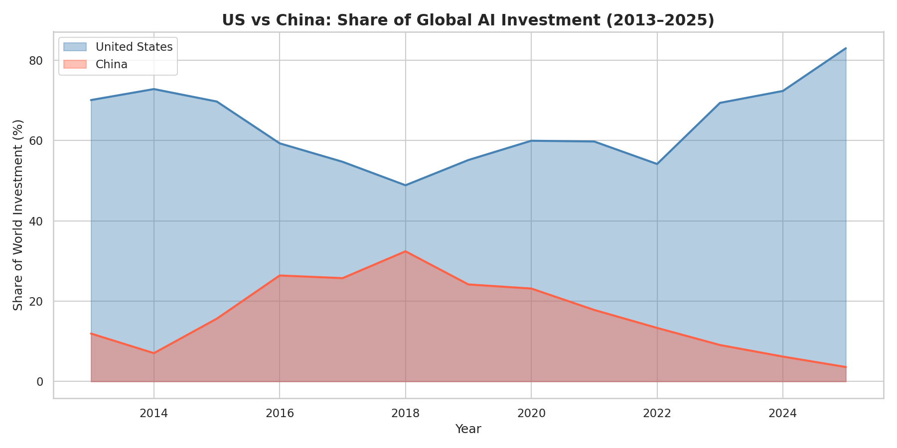

# AI Investment & Funding Trends

## Overview
This project analyzes global AI investment and funding trends 
using publicly available data. It explores how capital has flowed 
into AI companies over time, which sectors attract the most 
funding, and what policy implications emerge from these patterns.

## Research Questions
- How has AI investment grown over the past decade?
- Which AI sectors (healthcare, defense, NLP, etc.) attract the most capital?
- How do funding trends correlate with major policy events 
  (EU AI Act, U.S. Executive Orders, etc.)?

## Data Sources
- Stanford AI Index (annual report data)
- OECD AI Policy Observatory
- Our World in Data — AI Investment dataset

## Methods
- Data cleaning and wrangling with `pandas`
- Time-series visualization with `matplotlib` and `seaborn`
- Interactive charts with `plotly`

## Key Findings

### 1. AI Investment by Region (2013–2025)


### 2. Investment Trends & Key Policy Events


### 3. US vs China: Share of Global AI Investment


Key takeaways:
- The US accounts for **83% of global AI private investment in 2025** ($240B of $290B total)
- China peaked at ~32% of global share in 2018 and has declined sharply since
- US investment surged dramatically post-2022, coinciding with the ChatGPT launch
  and subsequent AI boom
- Europe remains a distant third, raising questions about competitiveness
  and the role of the EU AI Act in shaping investment incentives

## Policy Implications

- **US dominance is structural, not cyclical** — the gap with China and Europe
  is widening, not narrowing
- **Regulation timing matters** — the EU AI Act's proposal in 2021 coincides
  with a period of stagnant European investment share
- **Export controls appear effective** — China's declining share post-2022
  aligns with US chip and technology export restrictions

## How to Run
```bash
pip install -r requirements.txt
jupyter notebook notebooks/analysis.ipynb
```

## Author
[Arsham Nazeri](https://arsham-nazeri.github.io)